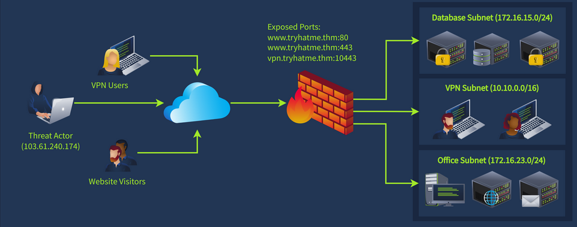
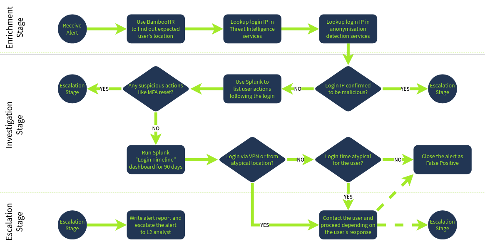

# SOC Workbook Lookups — Identity, Asset & Network Enrichment for Better Alert Triage

Modern SOC alert triage is rarely just about looking at a single alert and deciding whether it is malicious. In real-world environments, analysts constantly need additional context about users, systems, and network infrastructure before making a confident verdict.

This TryHackMe room focuses on exactly that—**lookups, enrichment, and SOC workbooks**.

Instead of blindly reacting to alerts, analysts learn how to answer practical questions like:

* Who owns this account?
* What is this server supposed to do?
* Is this network communication expected?
* Does this alert align with known attack behavior?
* What investigation steps should be followed consistently?

Let’s walk through the room practically.

---

# Learning Objectives

By completing this room, we understand how to:

* Use **Identity Inventory** for employee/user context
* Use **Asset Inventory** for host/server enrichment
* Interpret **network diagrams** for attack-path analysis
* Understand the role of **SOC workbooks / playbooks**
* Build investigation workflows for consistent triage

---

# Task 1: Introduction

SOC analysts often investigate alerts that initially lack context.

For example:

A user logs into a finance server, downloads a confidential spreadsheet, and shares it with another employee.

At first glance, that might look suspicious.

But context changes everything.

If the user is actually the CFO and the recipient is a financial adviser, the activity may be completely legitimate.

That is where enrichment becomes critical.

---

# Task 2: Assets & Identities

This section introduces two core SOC enrichment sources:

* Identity Inventory
* Asset Inventory

These are among the most useful lookup systems for analysts during triage.

## Identity Inventory

Identity inventory contains contextual information about users and service accounts.

Typical details include:

* Full Name
* Username
* Email
* Role
* Department
* Location
* Access permissions
* Privilege levels

This helps answer questions like:

* Is this user expected to access this system?
* Does their role justify this activity?
* Is the location suspicious?

Example:

If **G.Baker** is the CFO, accessing financial records makes sense.

If a random intern did the same, that would be very different.

### Common Identity Sources

* Active Directory
* Microsoft Entra ID
* Okta
* Google Workspace
* BambooHR
* SAP
* Internal CSV/Excel tracking

---

## Asset Inventory

Asset inventory helps identify system-level context.

Typical details:

* Hostname
* IP address
* Operating system
* Owner
* Location
* Business purpose

Example:

If a host named **HQ-FINFS-02** is labelled as:

> Financial records file server

Then seeing finance-related access becomes more understandable.

Without that metadata, you are guessing.

### Common Asset Sources

* Active Directory
* EDR platforms
* SIEM enrichment
* MDM platforms
* Custom inventory databases

---

## Answers

**Role of R.Lund:**
`US Financial Adviser`

**What does HQ-FINFS-02 store?**
`Financial records`

**Is the file sharing legitimate?**
`Yea`

---

# Task 3: Network Diagrams

This is where investigation becomes far more realistic.

Imagine logs showing:

* External IP repeatedly hitting TCP/10443
* Firewall NAT translation to internal IP
* Internal lateral scanning attempts
* Multiple subnet reconnaissance

Without network visibility, these logs look disconnected.

With a network diagram, the entire attack path becomes obvious.

SOC analysts should always understand:

* Network segmentation
* Firewall boundaries
* VPN access paths
* Internal trust relationships

---

## Practical Analysis

The observed flow:

External attacker:

```text
103.61.240.174
```

Repeatedly connects to:

```text
TCP/10443
```

This port corresponds to:

```text
VPN
```

Meaning likely attack scenario:

1. VPN brute-force
2. Successful authentication
3. Internal VPN IP assignment
4. Lateral movement attempts
5. Network reconnaissance

---


---

The attacker first scans:

```text
172.16.15.0/24
```

(Database subnet)

Then switches to:

```text
172.16.23.0/24
```

(Office subnet)

This strongly suggests active post-compromise behavior.

---

## Answers

**Service exposed on TCP/10443:**
`VPN`

**172.16.15.99 belongs to:**
`Database Subnet`

**Verdict:**
`TP`

This is clearly malicious.

---

# Task 4: Workbook Theory

SOC environments become chaotic without standardised investigation processes.

That is where workbooks come in.

Also known as:

* Playbooks
* Runbooks
* Investigation workflows

A workbook defines:

* What to check
* In what order
* Which tools to use
* When to escalate
* When to close

This reduces analyst inconsistency.

Without workbooks:

Junior analysts may:

* Miss enrichment
* Skip log correlation
* Ignore TI
* Close real incidents
* Escalate noise

With workbooks:

Investigations become repeatable and reliable.

---

## Typical Workbook Flow

Three logical stages:

### 1. Enrichment

Gather context.

Examples:

* User role
* Host owner
* Threat intel reputation
* Geolocation
* Historical activity

---

### 2. Investigation

Analyze evidence.

Examples:

* SIEM logs
* Authentication events
* Endpoint telemetry
* Process execution
* Network activity

---

### 3. Escalation / Resolution

Decide outcome.

Examples:

* Close as FP
* Escalate to L2
* Contact user
* Trigger containment

---


---

The workbook shown in this room uses:

```text
BambooHR
```

for identity enrichment.

A realistic enterprise choice.

---

## Answers

**Who uses workbooks most?**
`SOC L1 Analyst`

**Gathering user/host/IP context is called:**
`Enrichment`

**Identity inventory platform used:**
`BambooHR`

---

# Task 5: Workbook Practice

This section is more interactive than theoretical.

The goal is to build investigation logic using modular workflow blocks.

This reflects real-world SOC thinking.

Rather than memorising alerts, analysts should think:

* What is the alert type?
* What enrichment is needed?
* What logs matter?
* What conditions trigger escalation?

This is the foundation of efficient triage.

---

## Flags

Note: Add the three letters just before the Flag.

First workbook:

```text
{the_most_common_soc_workbook}
```

Second workbook:

```text
{be_vigilant_with_powershell}
```

Third workbook:

```text
{asset_inventory_is_essential}
```

---

# Key SOC Concepts Reinforced

## True Positive (TP)

A legitimate security incident.

Example:

* Confirmed brute force
* Confirmed malware execution
* Confirmed lateral movement

---

## False Positive (FP)

Benign activity that triggered an alert.

Example:

* Security scanner
* Legitimate admin login
* Approved software behavior

---

## Enrichment

Adding context to raw alerts.

Examples:

* User lookup
* Host lookup
* Threat intel
* Geolocation
* Historical activity review

Raw alerts without enrichment are often misleading.

---

## Why This Room Matters

Many beginners focus too heavily on tools.

But strong SOC analysis is less about clicking dashboards and more about asking the right investigative questions.

A great analyst doesn’t just see:

> "Login detected"

They ask:

* Who logged in?
* From where?
* Is this expected?
* What happened next?
* Does network behavior align?
* What does the workbook say?

That mindset separates reactive monitoring from actual incident analysis.

---

# Final Thoughts

This room does a solid job teaching a very practical but often overlooked SOC concept: **context-driven triage**.

Identity inventory, asset inventory, network diagrams, and structured workbooks are not optional extras—they are essential for making accurate alert decisions.

For junior analysts especially, mastering enrichment and investigation workflows can drastically improve triage quality and reduce mistakes.

A simple room, but highly relevant to real-world SOC operations. 🔍

---
